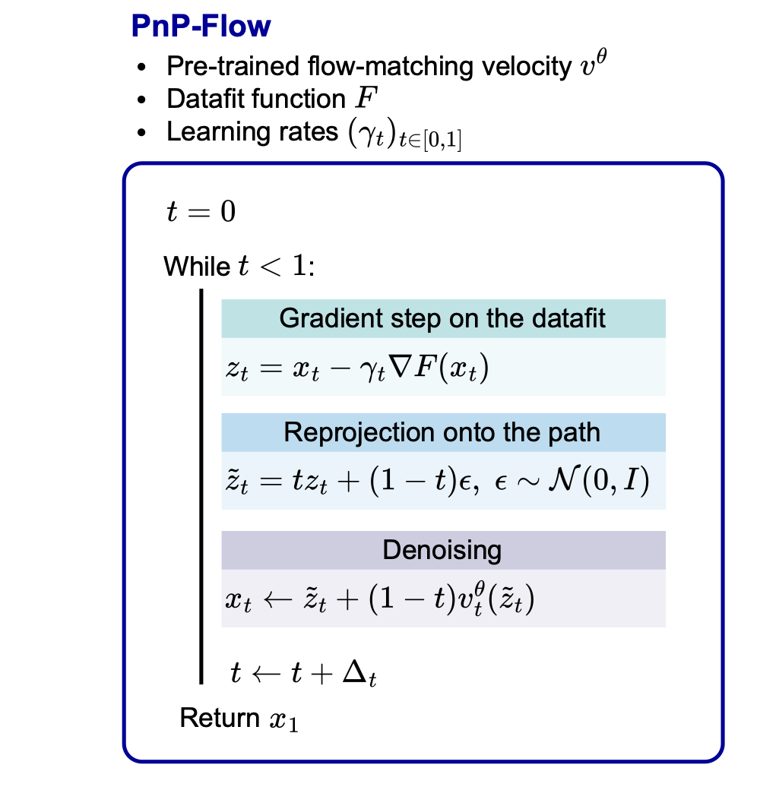

# PnP-Flow  
**Propriétaires du dépôt officiel :** Anne Genx et al.  

  


Ce dépôt contient le code de l’article ICLR 2025 [PnP-Flow](https://arxiv.org/pdf/2410.02423), une méthode combinant les approches Plug-and-Play avec des modèles Flow Matching pré-entraînés pour résoudre des problèmes de restauration d’images. **Essayez le [demo](https://github.com/annegnx/PnP-Flow/blob/main/demo/demo.ipynb)!**

  


## 1. Getting started

Clonez le dépôt et installez `pnpflow` :

```bash
cd PnP-Flow
pip install -e .
````

### 1.1. Requirements

* torch 1.13.1 (ou ultérieur)
* torchvision
* tqdm
* numpy
* pandas
* pyyaml
* scipy
* torchdiffeq
* deepinv

### 1.2. Download datasets and pretrained models

Nous fournissons un script pour télécharger les jeux de données et les réseaux pré-entraînés. Tous les fichiers se trouvent dans `data/` et `model/`.

* **CelebA.**

  ```bash
  bash download.sh celeba-dataset
  bash download.sh pretrained-network-celeba
  ```

* **AFHQ-CAT.**

  ```bash
  bash download.sh afhq-cat-dataset
  bash download.sh pretrained-network-afhq-cat
  ```

* **HES.**

  1. Placez vos images HES dans un répertoire (ex. `data/hes/`).
  2. Ajustez le chemin `root` dans `config/dataset_config/hes.yaml`.
  3. Téléchargez le meilleur checkpoint HES depuis le dossier Google Drive officiel :
     [https://drive.google.com/drive/u/2/folders/1tkKUuaRQNQ1vrjoytTspgH7OWUlmwyod](https://drive.google.com/drive/u/2/folders/1tkKUuaRQNQ1vrjoytTspgH7OWUlmwyod)
     Placez-le ensuite dans `model/hes/ot/`.

---

## 2. Training

Vous pouvez entraîner votre propre modèle Flow Matching OT.

* Modifier les options dans `config/main_config.yaml` ou passer en ligne de commande.
* Exemple pour CelebA :

  ```bash
  python main.py --opts dataset celeba train True eval False batch_size 128 num_epoch 100
  ```
* **Pour HES :**

  ```bash
  python main.py --opts dataset hes train True eval False batch_size 128 num_epoch 100
  ```

  Les checkpoints sont sauvegardés dans `./model/hes/ot/` et les échantillons générés dans `./results/hes/ot/`.

### Computing generative model scores

Après entraînement, calculez FID, Vendi et Slice Wasserstein :

```bash
python main.py \
  --opts dataset mnist \
  train False eval True compute_metrics True solve_inverse_problem False
```

---

## 3. Solving inverse problems & génération d’images

Les problèmes inverses disponibles :

* denoising
* gaussian\_deblurring
* superresolution
* inpainting (box, random, paintbrush)

Les méthodes implémentées :

* `pnp_flow`
* `ot_ode`
* `d_flow`
* `flow_priors`
* `pnp_diff`
* `pnp_gs`

### 3.1. Trouver les paramètres optimaux

```bash
bash scripts/script_val.sh
```

### 3.2. Évaluation sur test set

```bash
python main.py \
  --opts dataset celeba train False eval True problem inpainting method pnp_flow
```

ou

```bash
bash scripts/script_test.sh
```

### 3.3. Génération d’images HES

Après avoir entraîné ou téléchargé un checkpoint HES (ex. `model/hes/ot/model_best.pt`), lancez :

```bash
python pnpflow/image_generation/generate_HES.py \
  --cfg config/main_config.yaml \
  --model model/hes/ot/model_best.pt \
  --out_dir out/high_quality_single \
  --n_samples 1 \
  --batch_size 1 \
  --seed 50 \
  --use_sde \
  --sample_N 1000
```

Les images seront enregistrées dans `out/high_quality_single`.

---

## Acknowledgements

Ce dépôt s’appuie sur :

* [PnP-GS](https://github.com/samuro95/GSPnP)
* [DiffPIR](https://deepinv.github.io/deepinv/)
* [Rectified Flow](https://github.com/gnobitab/RectifiedFlow)


